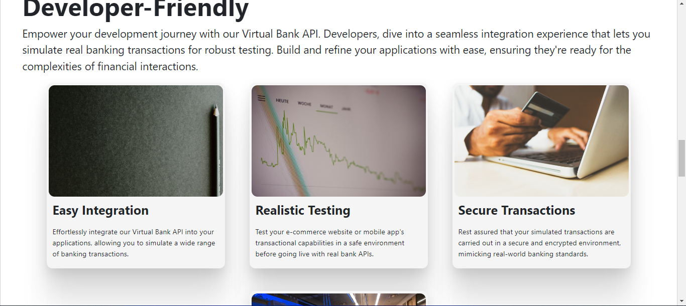

# Virtual Bank Web Application and API

## Introduction

Welcome to the Virtual Bank project, a web application and API designed for simulating banking transactions. This project allows developers to test e-commerce website transactions before implementing real bank APIs. The application is built using Django and provides a comprehensive set of functionalities for transaction simulation.

- [**Live Demo**](http://www.virtualbank.tech/)
- [**Final Project Blog Article**](#)
- **Author:** Adeniji Olajide ([LinkedIn](https://www.linkedin.com/in/olajide-adeniji-0286a32a2/)) ([Twitter](https://twitter.com/Goldenthrust3))



## Installation

To set up the Virtual Bank project locally, follow these steps:

1. Clone the repository:
   ```bash
   git clone https://github.com/your-username/virtual-bank.git
   cd virtual-bank
   ```
2. Run the installation script:
    ```bash
    chmod +x install.sh
    ./install.sh
    ```
3. Create a .env file in the root directory and add the following environment variables:
    ```dotenv
    # .env file
    DB_USER=your_db_username
    DB_PASSWORD=your_db_password
    ```
    Configure your PostgreSQL database by creating a user with the provided credentials (DB_USER and DB_PASSWORD).
    If you need help setting up PostgreSQL, you can refer to the [official documentation](https://www.postgresql.org/docs/current/tutorial-start.html).
4. Run migrations
    - API
    ```bash
    cd api/
    python3 manage.py makemigrations
    python3 manage.py migrate
    ```

    - Clients
    ```bash
    cd clients/
    python3 manage.py makemigrations
    python3 manage.py migrate
    ```
5. Start the development server:
    - API
    ```bash
    cd api/
    python manage.py runserver
    ```

    - clients
    ```bash
    cd clients/
    python manage.py runserver
    ```
    Access the application in your browser at http://localhost:8000/.

## Contributing
Contributions are welcome! Follow these steps to contribute:

1. Fork the repository.
2. Create a new branch: ``` git checkout -b feature/new-feature  ```
3. Make your changes and commit them: ``` git commit -m 'Add new feature' ```.
4. Push to the branch: ``` git push origin feature/new-feature ```.
5. Submit a pull request.

## Related Projects

Explore other related projects that offer real-world payment solutions:

- [Stripe API](https://stripe.com/docs/development/): The official Stripe API. A widely-used payment gateway for handling real transactions securely.
- [PayPal Developer](https://developer.paypal.com/): PayPal's official checkout SDK for integrating PayPal payments into your applications.

These projects provide robust and secure payment solutions that go beyond dummy data, suitable for real-world applications and e-commerce platforms.


## How the project come to live
> comming soon


## Licensing
The Virtual Bank project is licensed under the MIT License.

